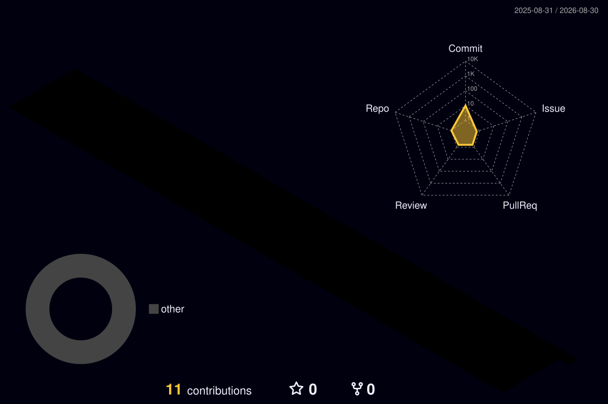
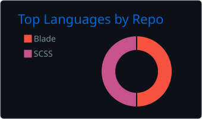
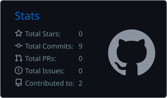

# Hi there, I'm Enes Taha 👋

### Software Engineer • Backend Developer

I'm a Software Engineer passionate about backend development. Currently sharpening my Laravel, PHP, and backend skills by building real-world projects.

## 👨‍💻 About Me

- 💻 Software Engineer focused on **Backend Development**
- 🚀 Building web applications with **Laravel**
- 🌱 Continuously improving my PHP & Laravel skills
- 📚 Interested in software architecture, clean code, and database design
- 💬 Always happy to talk about PHP, Laravel, MySQL & REST APIs

## 🛠️ Tech Stack

  

## 🌱 Currently Learning

- Laravel Best Practices
- RESTful API Development
- Authentication & Authorization
- Database Design
- Clean Code Principles

## 📊 GitHub Stats

  

  
  

### *"Code. Learn. Improve. Repeat."*

